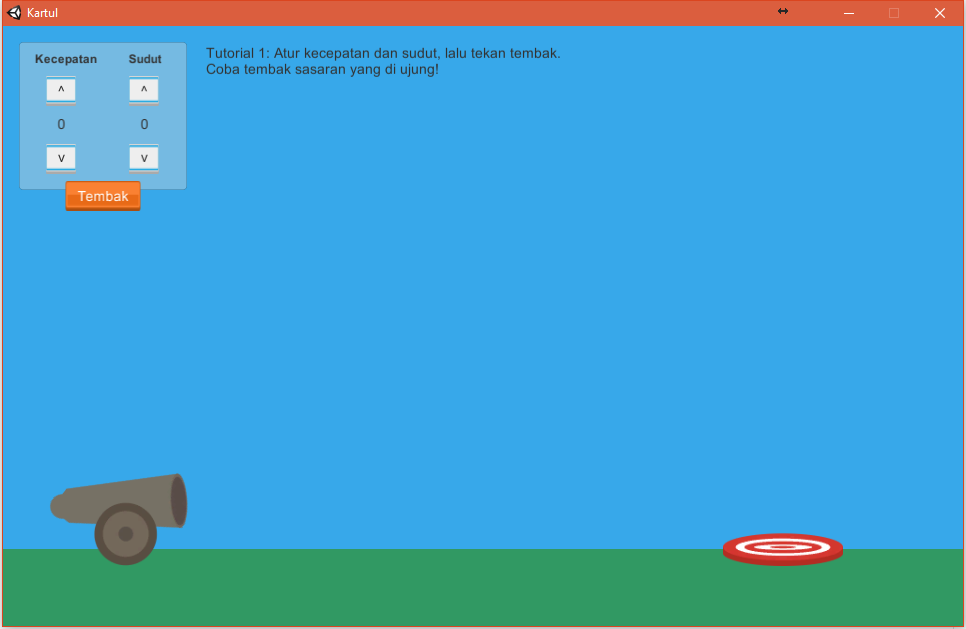

# edugame

This is an education game made with Unity3D in Fall 2015 for my high school research paper. My thesis was "Can game be used as an education tool?". The game is centered around the concept of projectile motion. The player has to shoot a cannon towards targets by modifying the speed and angle of the cannon. The player is encouraged to use the formula of projectile motion, instead of blindly shooting the cannon, to finish the game with higher scores.

To play the latest version of the game, you can download it [here](edugame.rar). (**Note: Current version is in Indonesian language**)

Screenshot of the game.

## To Do

- [ ] Update the project to the latest Unity3D version.
- [ ] Translate the game to English.
- [ ] Update the UI so it will work with different screen sizes.
- [ ] Replace the score database from dreamlo.com to something else.
